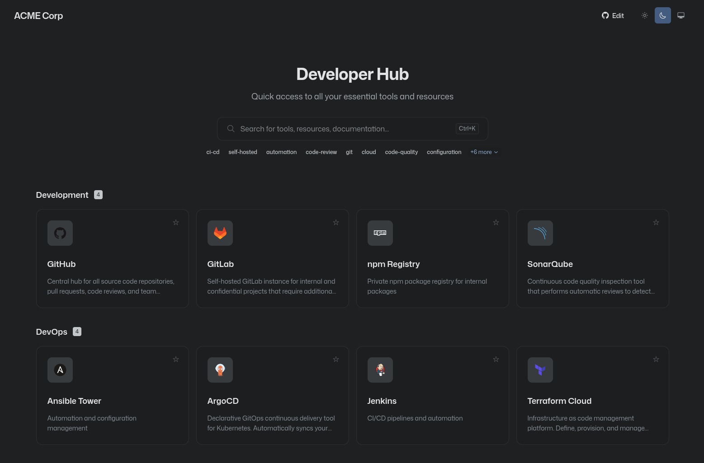

# DevHub
<center>
  
</center>

## Features

- 🔍 **Search** - Quickly find tools with real-time filtering (Ctrl+K / ⌘K)
- 🏷️ **Tags** - Filter links by tags for easier discovery
- ⭐ **Favorites** - Mark frequently used links for quick access (persisted locally)
- 🌓 **Theme Switcher** - Light, dark, and system theme support
- 📱 **Responsive** - Works great on desktop and mobile
- 🔗 **Shareable URLs** - Search and tag filters are persisted in the URL
- ✏️ **Easy Configuration** - Single config file for all customization
- 🚀 **GitHub Actions** - Automatic deployment to GitHub Pages

## Getting Started

### Prerequisites

- Node.js 20+
- pnpm (recommended) or npm

### Installation

```bash
# Clone the repository
git clone https://github.com/naueramant/devhub.git
cd devhub

# Install dependencies
pnpm install

# Start development server
pnpm dev
```

### Building for Production

```bash
pnpm build
```

The built files will be in the `dist` directory.

## Configuration

All configuration is done in `src/config.ts`. Here's an overview of the available options:

### Branding

```typescript
export const config: Config = {
  companyName: "Acme Corp",           // Optional: Company name in header
  companyLogo: "/logo.svg",           // Optional: Logo path (in public folder)
  githubEditUrl: "https://...",       // Optional: Link to edit config on GitHub
};
```

### Layout & Behavior

```typescript
export const config: Config = {
  // ...branding options

  categorySorting: "alphabetical",    // "alphabetical" | "defined"
  linkSorting: "defined",             // "alphabetical" | "defined"
  categories: ["Dev", "DevOps"],      // Optional: Custom category order
  gridColumns: 4,                     // Number of columns (default: 4)
  linkTarget: "new-tab",              // "same-tab" | "new-tab" | "new-window"
};
```

### Adding Links

Links are defined in the `links` array in `src/config.ts`:

```typescript
export const links: Link[] = [
  {
    href: "https://github.com/your-org",
    title: "GitHub",
    description: "Source code repositories",  // Optional
    icon: "devicon/github-original",           // Optional (shows link icon if omitted)
    category: "Development",                   // Optional (defaults to "Other")
    tags: ["git", "code"],                     // Optional: For filtering
  },
  // ... more links
];
```

Only `href` and `title` are required. All other fields are optional.

### Icon Options

The `icon` field supports multiple formats:

1. **Devicon** (recommended): `"devicon/github-original"` - Uses [devicon.dev](https://devicon.dev) icons
2. **URL**: `"/icons/custom.svg"` or `"https://example.com/icon.png"`
3. **Emoji**: `"🚀"`

For devicon, use the format `devicon/{name}-{style}` where style is:
- `original` - Colored SVG
- `plain` - Monochrome font icon
- `line` - Outline font icon

## Deployment

### GitHub Pages

This project includes a GitHub Actions workflow for automatic deployment to GitHub Pages.

1. Go to repository **Settings → Pages**
2. Set **Source** to "GitHub Actions"
3. Push to the `main` branch

The site will be deployed automatically on each push.

### Other Platforms

Build the project and deploy the `dist` folder to any static hosting:

```bash
pnpm build
# Deploy ./dist to your hosting provider
```

## Tech Stack

- [React](https://react.dev) - UI framework
- [MUI Joy UI](https://mui.com/joy-ui/getting-started/) - Component library
- [Vite](https://vite.dev) - Build tool
- [TypeScript](https://www.typescriptlang.org/) - Type safety
- [Zustand](https://zustand-demo.pmnd.rs/) - State management
- [react-icons](https://react-icons.github.io/react-icons/) - Icon library

## License

This project is licensed under the GNU General Public License v3.0 (GPL-3.0) - see the [LICENSE](LICENSE) file for details.
